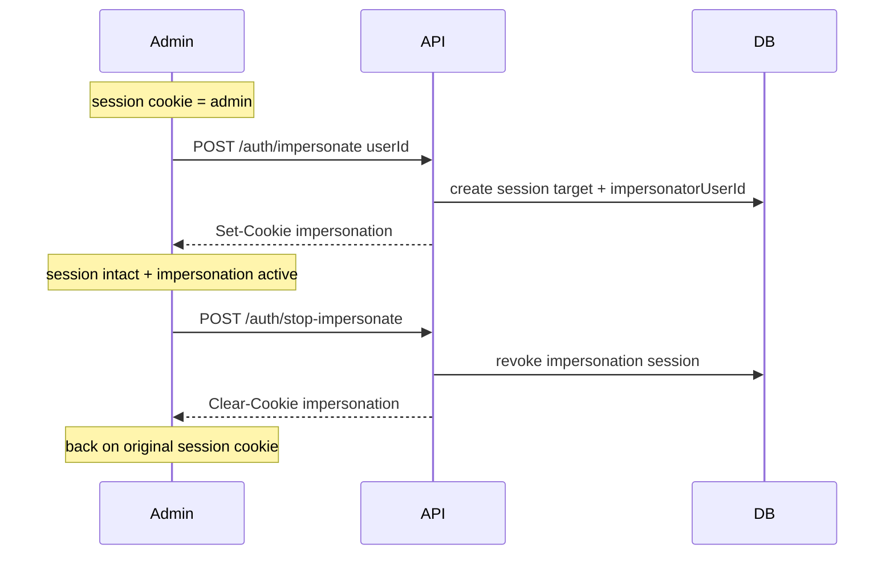

# Auth Impersonation Feature

## Cookie strategy (dual cookie)

**Use a separate impersonation cookie.** Replacing the admin `session` cookie forces recreate-on-stop and loses the original session. Dual cookies keep the admin account intact:

| Cookie | Constant | Role |
|--------|----------|------|
| `session` | `SESSION_COOKIE_NAME` | Real logged-in admin (unchanged while impersonating) |
| `impersonation` | `IMPERSONATION_COOKIE_NAME` (new) | Session row for the target user with `impersonatorUserId` set |

**Auth `onRequest` resolve order:**

1. If `impersonation` cookie verifies → `locals.user` = target user + permissions; attach `impersonator` from that session’s `impersonatorUserId`
2. Else if `session` cookie verifies → normal user, `impersonator: null`
3. Else → unauthenticated

**Start:** create session `{ userId: target, impersonatorUserId: admin }`, set **only** the `impersonation` cookie. Do **not** revoke or rewrite `session`.

**Stop:** revoke the impersonation session (if present), clear `impersonation` cookie. Admin `session` cookie is untouched → immediately back as the original admin.

**Sign out:** clear **both** cookies and revoke both sessions when present.

**Permission checks while impersonating:** `locals.user.permissions` are the target’s. Start impersonation is gated by `allow` on the admin identity — reject start if an `impersonation` cookie is already active (`AlreadyImpersonatingError`). Stop does not use `admin:*` (special-cased: any valid impersonation cookie).



## 1. Permission + DB

In [`packages/plank-db/src/schema.ts`](packages/plank-db/src/schema.ts), add `"admin:impersonate"` to `permissionEnum`.

Wire `impersonatorUserId` through create:

- Extend [`createSession`](packages/plank-db/src/queries/sessions.ts) `Pick` to include optional `impersonatorUserId`
- Add `findUserById` in [`packages/plank-db/src/queries/users.ts`](packages/plank-db/src/queries/users.ts) for target validation

Generate/apply a Drizzle migration for the new enum value (and ensure `impersonator_user_id` is live if not already pushed). Config: [`packages/plank-db/drizzle.config.ts`](packages/plank-db/drizzle.config.ts).

Sync OpenAPI permission unions in:

- [`packages/plank-server/src/modules/auth/routes/verify.ts`](packages/plank-server/src/modules/auth/routes/verify.ts)
- [`packages/plank-server/src/modules/user/routes/index.ts`](packages/plank-server/src/modules/user/routes/index.ts)
- [`packages/plank-server/src/modules/roles/routes/index.ts`](packages/plank-server/src/modules/roles/routes/index.ts)

Superadmin keeps `write:all` / `read:all` only; routes allow `["admin:impersonate", "write:all"]`.

## 2. Session service + auth hook

In [`session.service.ts`](packages/plank-server/src/modules/session/session.service.ts) / constants:

- Add `IMPERSONATION_COOKIE_NAME = "impersonation"` next to `SESSION_COOKIE_NAME`
- `CreateSessionOptions`: optional `impersonatorUserId`
- `VerifyResult`: add `impersonator: Pick<User, "id" | "email" | "name"> | null` (only when session has `impersonatorUserId`)
- Pass `impersonatorUserId` into `createSession`

Update [`auth.module.ts`](packages/plank-server/src/modules/auth/auth.module.ts) + [`RequestUser`](packages/plank-server/src/server/types.ts) for dual-cookie resolve and optional `impersonator` on locals.

Update [`signout`](packages/plank-server/src/modules/auth/routes/signout.ts) to clear/revoke both cookies.

Update verify (and dashboard loader cookie reading) so the client can send/see impersonation state: verify should prefer the impersonation cookie when present (or accept both and document precedence). Response includes nullable `impersonator` plus the effective user.

## 3. Auth API

New routes under `packages/plank-server/src/modules/auth/routes/`:

| Route | Auth | Behavior |
|-------|------|----------|
| `POST /auth/impersonate` | `allow: ["admin:impersonate", "write:all"]` | Body `{ userId }`. Resolve **real** admin from `session` cookie (ignore/forbid if already has active `impersonation`). **400 `CannotImpersonateSelfError`** if `userId === admin.id` (message e.g. “You cannot impersonate yourself.”). 404 if target missing. Create impersonation session; set `impersonation` cookie only; return target + impersonator. |
| `POST /auth/stop-impersonate` | No `allow` | Require valid `impersonation` cookie. Revoke that session; clear `impersonation` cookie. 400 `NotImpersonatingError` if none. Return the admin user from the still-valid `session` cookie. |

Errors in `modules/auth/errors.ts`:

- `CannotImpersonateSelfError` — status 400, stable code (e.g. `ERR-AUTH-00xx`), clear message that you cannot impersonate yourself
- `AlreadyImpersonatingError`
- `NotImpersonatingError`
- User-not-found as needed

Full OpenAPI on both routes (`tags: ["Auth"]`, summary, description, body, responses including 400 self-impersonate).

## 4. Codegen

```bash
pnpm --filter @plank/client codegen
```

## 5. Web UI

**Users table** — [`user-row-actions.tsx`](apps/plank-web/src/features/dashboard/users-management/components/user-row-actions.tsx):

- Impersonate menu item (e.g. `VenetianMask`) above Delete
- `canImpersonate`: not self, has `admin:impersonate` or `write:all`, not already impersonating
- `ImpersonateUserDialog` (`Trigger asChild` + children) → mutation → toast → revalidate
- “No actions available” only when neither delete nor impersonate applies
- Wire from [`manage-users-page.tsx`](apps/plank-web/src/features/dashboard/users-management/components/manage-users-page.tsx)

**Global fixed top bar** (primary stop UI) — in [`dashboard-page-layout.tsx`](apps/plank-web/src/features/dashboard/components/dashboard-page-layout.tsx) (or a small dedicated component next to it):

- When loader/verify reports `impersonator`, render a **fixed top bar** above the dashboard chrome (full width, high z-index)
- Copy: you are impersonating **{target name}** (and optionally email)
- Primary button: **Stop impersonating** → `postAuthStopImpersonateMutation` (`credentials: "include"`) → toast → revalidate
- Layout: offset main content / sidebar so the bar does not cover the header (e.g. padding-top or a sticky banner slot above `SidebarProvider`)

No separate NavUser “Stop” item — the fixed bar is the single obvious control.

Dashboard loader/signout must read/clear the `impersonation` cookie the same way as `session` where relevant (SSR verify path).

## Out of scope

- Nested impersonation
- Impersonator columns on the sessions admin table
- Changing `write:all` semantics beyond route `allow` arrays
