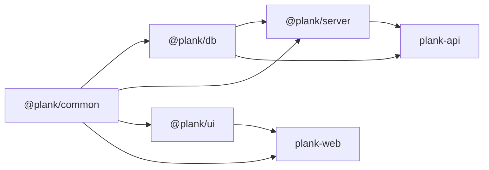

# Extract shared code into `@plank/common`

## Current state

[`packages/plank-common`](packages/plank-common) is an empty stub (`package.json` only, no `src/`, no consumers). Root README lists it as “Shared utilities.”

`apps/plank-api` is thin bootstrap only — nothing to extract from there.



## Move (yes)

### 1. Permissions — highest value

Today duplicated / drifted:

| Location | Issue |
| --- | --- |
| [`packages/plank-db/src/schema.ts`](packages/plank-db/src/schema.ts) | Source of truth `permissionEnum` + `Permission` |
| Server routes (user / roles / verify) | Same `PermissionSchema` Type.Union ×3 |
| [`create-role-page.tsx`](apps/plank-web/src/features/dashboard/roles-management/components/create-role-page.tsx) | `PERMISSION_OPTIONS` **missing `admin:impersonate`** |
| Table filters / manage pages | Partial `"read:all" \| "write:all"` hardcoding |

**Put in common:**

```ts
export const PERMISSIONS = [
  "write:all", "read:all",
  "admin:create:users", /* … */, "admin:impersonate",
] as const;
export type Permission = (typeof PERMISSIONS)[number];
export function hasPermission(user: readonly Permission[], required: Permission): boolean;
```

**Consumers:**

- `@plank/db`: `pgEnum("permission", [...PERMISSIONS])`; re-export `Permission` from common (or import type only)
- `@plank/server`: one shared TypeBox helper built from `PERMISSIONS` (e.g. `PermissionSchema = Type.Union(PERMISSIONS.map(Type.Literal))`) used by user/roles/verify routes; import `Permission` from `@plank/common` instead of `@plank/db`
- `@plank/web`: use `PERMISSIONS` for create-role combobox + filter options; use `Permission` / `hasPermission` in manage-users (impersonate gate)

### 2. Session / impersonation cookie + TTL constants

Duplicated today:

- [`packages/plank-server/src/modules/session/constants.ts`](packages/plank-server/src/modules/session/constants.ts) — source
- [`dashboard-page-layout.tsx`](apps/plank-web/src/features/dashboard/components/dashboard-page-layout.tsx) — local `SESSION_COOKIE_NAME` / `IMPERSONATION_COOKIE_NAME`

**Move to common:** `SESSION_COOKIE_NAME`, `IMPERSONATION_COOKIE_NAME`, `SESSION_TTL_MS`.

Cookie **options** (`httpOnly`, `sameSite`, `secure`) stay in server (Fastify-shaped). Fetch `getCookie` stays in web.

### 3. `SortInput` type + fix UI → db coupling

Today:

- [`sort-parser.ts`](packages/plank-db/src/queries/sort-parser.ts) — `SortInput` + nuqs `parseAsSort` / `parseAsSorting`
- [`@plank/ui`](packages/plank-ui/src/hooks/use-search-params.ts) peers `@plank/db` only for those parsers
- Server list routes duplicate `SortInputSchema` ×3

**Move:**

| Symbol | Destination |
| --- | --- |
| `SortInput` | `@plank/common` |
| `parseAsSort` / `parseAsSorting` | `@plank/ui` (nuqs-coupled) |
| `buildOrderBy` | stay in `@plank/db` |
| `SortInputSchema` | stay in `@plank/server` (one shared helper) |

Drop `@plank/db` from `@plank/ui` peerDependencies; add `@plank/common` where needed. Remove `nuqs` from `@plank/db` dependencies if unused after the move.

### 4. Auth identity types (small, include)

Shared TS shapes used by server `RequestUser` / verify response and web loader:

```ts
export type AuthIdentity = { id: string; email: string; name: string };
export type AuthenticatedUser = AuthIdentity & {
  permissions: Permission[];
  impersonator: AuthIdentity | null;
};
```

TypeBox schemas stay in server. Generated client types remain for API responses.

## Do not move

- Drizzle schema/relations/migrations/queries → `@plank/db`
- Fastify routes, TypeBox `SuccessResponse`/`ErrorResponse`, error classes, Argon2, Awilix, BullMQ → `@plank/server`
- React / DataTable / RHF / `cn` → `@plank/ui` / web
- Generated `@plank/client` SDK
- Error code strings — only if web later branches on `code`
- `SUPER_ADMIN_ROLE_NAME`, `authProviderEnum` — single-consumer for now
- `isUniqueViolation` — server-only pg helper (consolidate in server later if desired)
- `apps/plank-api` — nothing to extract

## Package scaffold

Wire [`packages/plank-common`](packages/plank-common) like other source packages:

```
packages/plank-common/
  package.json          # exports, @plank/tsconfig, typescript
  tsconfig.json
  src/
    permissions.ts
    session.ts
    sorting.ts
    auth.ts
    index.ts
```

Zero runtime deps (pure TS). Dependents add `"@plank/common": "workspace:*"`.

## Phases and commits

**Commit after every phase.** Each phase must leave the workspace typecheck-clean (or at least not worse than before) before committing. Follow the user git commit protocol (HEREDOC message, no amend unless asked, no push).

| Phase | Work | Commit message focus |
| --- | --- | --- |
| 1 | Scaffold `@plank/common` + exports (`permissions`, `session`, `sorting`, `auth` modules; wire workspace deps on consumers that will need them) | add `@plank/common` package scaffold |
| 2 | Move permissions → update db schema, server schemas/types, web create-role + filters + gates | share permissions via `@plank/common` |
| 3 | Move cookie/TTL constants → server + web dashboard layout import common | share session cookie constants |
| 4 | Move `SortInput` → common; nuqs parsers → ui; update db `sort.ts` / queries; drop ui→db peer | decouple sort types from `@plank/db` |
| 5 | Add auth types; align `RequestUser` / web loader typing | share auth identity types |
| 6 | Final typecheck across db/server/ui/web; commit only if fixes remain | fix typecheck fallout from common extract (skip empty commit) |

## Out of scope for this pass

Server-internal dedupe of `isUniqueViolation`, cookie option blobs, pagination TypeBox defaults — keep in server unless a second non-server consumer appears.
