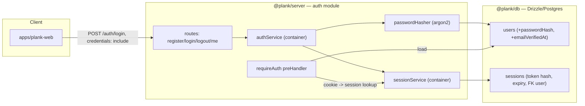

## Architecture



## 1. Schema changes — [packages/plank-db/src/schema.ts](packages/plank-db/src/schema.ts)

Extend `users` and add a `sessions` table.

- Add to `users`: `passwordHash: text("password_hash")` (nullable, to allow future OAuth-only users) and `emailVerifiedAt: timestamp("email_verified_at", { withTimezone: true })` (nullable).
- Add `sessions` table: `id` (uuid pk), `userId` (uuid fk → `users.id`, `onDelete: cascade`), `tokenHash` (text, unique — store SHA-256 of the random token, never the raw token), `expiresAt` (timestamp timestamptz, notNull), `createdAt`, `updatedAt` (with `.$onUpdate`).
- Export `sessions`, `Session`, `NewSession` types.

Example shape:

```typescript
export const sessions = pgTable("sessions", {
  id: uuid("id").defaultRandom().primaryKey(),
  userId: uuid("user_id")
    .notNull()
    .references(() => users.id, { onDelete: "cascade" }),
  tokenHash: text("token_hash").notNull().unique(),
  expiresAt: timestamp("expires_at", { withTimezone: true }).notNull(),
  createdAt: timestamp("created_at", { withTimezone: true }).defaultNow().notNull(),
  updatedAt: timestamp("updated_at", { withTimezone: true })
    .defaultNow()
    .notNull()
    .$onUpdate(() => new Date()),
});
```

Then generate a migration via the drizzle skill (`just db generate` → `drizzle-kit generate`), following the `drizzle-generate` skill workflow.

## 2. DB queries — [packages/plank-db/src/queries/](packages/plank-db/src/queries/)

- Extend [users.ts](packages/plank-db/src/queries/users.ts): add `createUser(db, { email, name, passwordHash })`, `getUserByEmail(db, email)`, `getUserById(db, id)`.
- New `sessions.ts`: `createSession(db, { userId, tokenHash, expiresAt })`, `getSessionByTokenHash(db, tokenHash)` (join `users`, filter `expiresAt > now()`), `deleteSession(db, tokenHash)`, `deleteSessionByHash(db, tokenHash)`.
- Re-export from [packages/plank-db/src/index.ts](packages/plank-db/src/index.ts) so server can import `@plank/db/queries/sessions`.

## 3. Auth server module — `packages/plank-server/src/modules/auth/`

New `AuthModule extends ServerModule` (`name = "auth"`, `routePrefix()` returns `/auth`). Override `register(context)` to:
1. Register `@fastify/cookie` on `context.app` with `secret` from options (signed cookie).
2. Register DI services into `context.container`: `passwordHasher`, `sessionService`, `authService` (as `asClass`, non-singleton so each request scope resolves the request-scoped `db`).
3. Call `await super.register(context)` to register routes from `routes/`.

### Services (in `modules/auth/services/`)
- `password.ts` — `PasswordHasher` class: `hash(plain): Promise<string>` (argon2id) and `verify(hash, plain): Promise<boolean>`.
- `session.ts` — `SessionService` (deps: `db`): `generateToken()` (crypto.randomBytes → base64url), `hashToken(token)` (node:crypto sha-256 hex), `create(userId)` (insert session, return raw token), `findByToken(token)` (lookup by hash, return `{ user, session }`), `revoke(token)`.
- `auth.ts` — `AuthService` (deps: `db`, `passwordHasher`, `sessionService`): `register({ email, name, password })` (throw on duplicate email), `login({ email, password })` (verify, throw on mismatch), `logout(token)`, `getSessionUser(token)`.

### Routes (in `modules/auth/routes/`, each uses `defineRoute` with TypeBox schemas)
- `register.ts` — `POST /auth/register`: body `{ email, name, password }` → creates user, creates session, sets cookie, returns `{ user }`.
- `login.ts` — `POST /auth/login`: body `{ email, password }` → validates, creates session, sets cookie, returns `{ user }`.
- `logout.ts` — `POST /auth/logout`: reads cookie, revokes session, clears cookie, returns `{ ok: true }`. Public (no auth required).
- `me.ts` — `GET /auth/me`: uses `requireAuth` preHandler, returns the current `{ user }`.

Cookie: name `plank_session`, `httpOnly: true`, `sameSite: "lax"`, `secure: NODE_ENV === "production"`, `path: "/"`, `signed: true`, `maxAge` = session TTL.

### `requireAuth` hook — `modules/auth/hooks/require-auth.ts`
Exported `preHandler` that reads the session cookie via `request.unsignCookie(reply.unsignCookie(...))` (or `request.cookies` with the registered secret), looks up the session via `sessionService`, throws `401` if missing/invalid/expired, and assigns `request.user`. Also extend [types.ts](packages/plank-server/src/server/types.ts):
- `declare module "fastify"`: add `user?: User` to `FastifyRequest`.
- Extend the request container type with `passwordHasher`, `sessionService`, `authService`.

Re-export `AuthModule` and `requireAuth` from [packages/plank-server/src/index.ts](packages/plank-server/src/index.ts).

## 4. Dependencies & wiring

- Add to [packages/plank-server/package.json](packages/plank-server/package.json): `@fastify/cookie` and `argon2`.
- Add to [apps/plank-api/.env.example](apps/plank-api/.env.example): `AUTH_COOKIE_SECRET=<32+ char random string>` and `AUTH_SESSION_TTL_SECONDS=2592000` (30d).
- Wire into [apps/plank-api/src/index.ts](apps/plank-api/src/index.ts): import `AuthModule`, push `new AuthModule({ cookieSecret: process.env.AUTH_COOKIE_SECRET!, sessionTtlSeconds: Number(process.env.AUTH_SESSION_TTL_SECONDS ?? 2592000) })` before `HealthcheckModule`. Ensure `AuthModule` registers before any module whose routes need `requireAuth`.

## 5. Client / web follow-up (out of strict scope, noted)

- Re-run codegen (`just codegen` / [packages/plank-client/bin/codegen.ts](packages/plank-client/bin/codegen.ts)) so `@plank/client` gets `register`/`login`/`logout`/`me` SDK methods.
- Configure the generated client / fetch calls in [apps/plank-web](apps/plank-web) to send credentials (`credentials: "include"`) so the cookie flows. Add a tiny auth context + login/register UI in a follow-up.

## Key files to change
- [packages/plank-db/src/schema.ts](packages/plank-db/src/schema.ts) — add `passwordHash`, `emailVerifiedAt`, `sessions` table.
- `packages/plank-db/src/queries/sessions.ts` — new.
- [packages/plank-db/src/queries/users.ts](packages/plank-db/src/queries/users.ts) — extend.
- `packages/plank-server/src/modules/auth/` — new module (module, services, hooks, routes).
- [packages/plank-server/src/server/types.ts](packages/plank-server/src/server/types.ts) — request `user` + container types.
- [packages/plank-server/src/index.ts](packages/plank-server/src/index.ts) — export `AuthModule`, `requireAuth`.
- [packages/plank-server/package.json](packages/plank-server/package.json) — `@fastify/cookie`, `argon2`.
- [apps/plank-api/src/index.ts](apps/plank-api/src/index.ts) — wire module.
- [apps/plank-api/.env.example](apps/plank-api/.env.example) — new env vars.
- New Drizzle migration under `packages/plank-db/migrations/`.

## Todos
